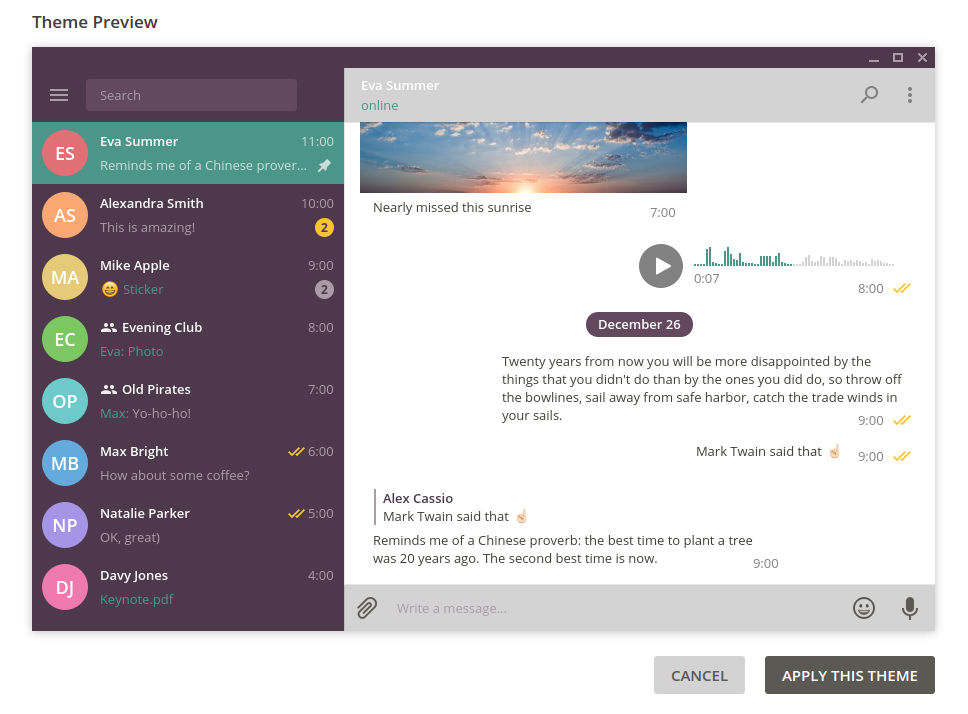
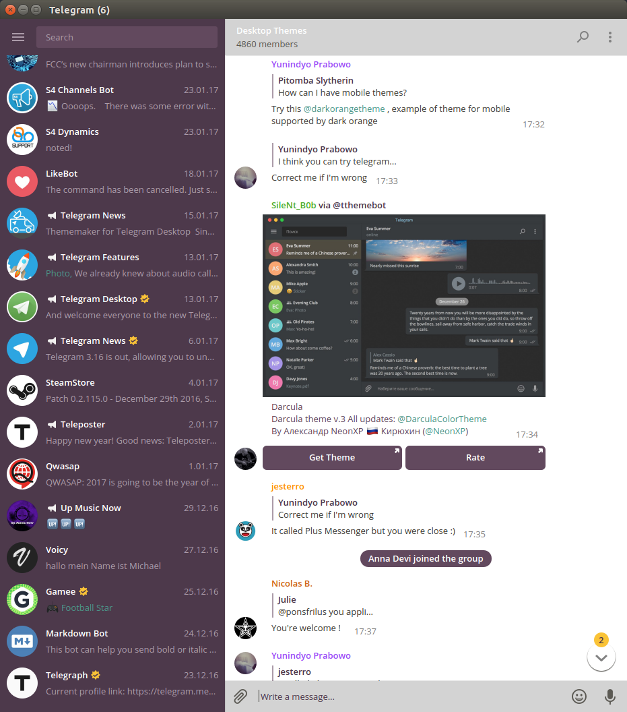

# tlack-telegram-theme
#### Version 1.0
A telegram desktop theme made for being productive! Keep your heads down and get your stuff done with tlack.

### Install
1. Clone the git repisitory github.com/michaelkisiel/tlack-telegram-theme or download the file [tlack.tdesktop-theme](https://github.com/michaelkisiel/tlack-telegram-theme/blob/master/tlack.tdesktop-theme)
2. Paste the file into any chat of your telegram desktop client
3. You will be asked to apply the theme showing you a preview before

But here's also an official Telegram Support guide on how to edit and install Telegram Desktop themes: http://telegra.ph/Create-Telegram-Theme-01-12.

### Credits
Thanks [MasterGroosha](https://github.com/MasterGroosha/telegram-soliddark-theme) for his original source code. :thumbsup:

### Contact
Just send me [@droopyMcCool](https://t.me/droopymccool) a message in telegram. :wink:

### Screenshots

